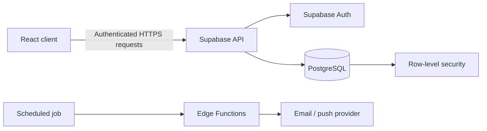
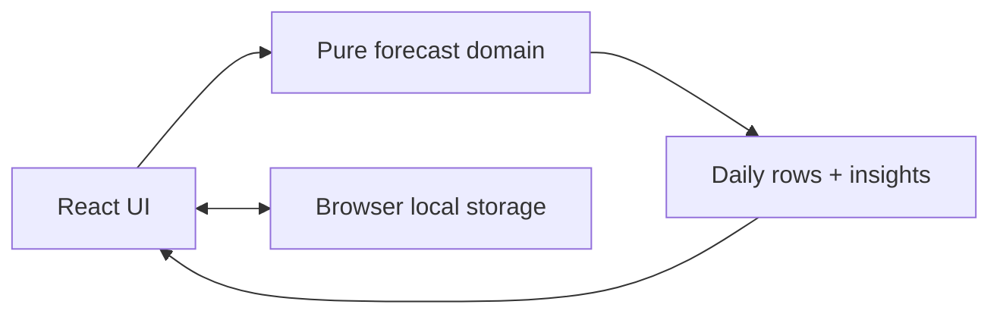

# Cash Flow Forecaster - Concrete Implementation Plan

This is the build plan for the Shortcut Asia Internship Challenge. It implements one complete workflow:

> A user who does not yet have a clear budget answers a few practical prompts about their money habits. The app turns those answers into editable scheduled income/expense items, then shows an auditable daily cash forecast, its lowest point, and any shortfall risk.

The goal is not to build a finance platform or automatically categorise bank transactions. The goal is to make one decision - **"when will my balance be tight, and why?"** - accurate, usable, and explainable, even when the user starts with only rough estimates.

## 0. Freeze the product contract before writing UI

Do this in a `DECISIONS.md` file before coding. Do not change these rules casually later; if a rule changes, update its tests and document why.

### In scope

- Single user, one local forecast plan.
- A short guided money-discovery setup that asks about income, groceries, transport/petrol, household bills, and subscriptions, then creates editable forecast items from the answers.
- Opening balance, forecast start date, and a fixed 30-day horizon.
- Income and expense items that recur `once`, `weekly`, `monthly`, or `yearly`.
- Add, edit, delete, save, load, forecast, daily ledger, lowest-balance insight, and first-negative-balance warning.
- A line chart only after the ledger and summary are correct.

### Out of scope

- User accounts, backend, bank data, transaction categorisation, notifications, budgets, data sharing, multiple currencies, real payment advice, tax, and arbitrary calendar rules.
- Trying to infer exact spending from rough answers. The app labels these items as estimates and lets the user correct them; it never presents a guess as a fact.
- 60-day forecasts until the 30-day version is complete and tested. If time remains, a horizon dropdown can be added without changing the engine.

### Exact business rules

| Topic | Rule |
| --- | --- |
| Currency | Malaysian Ringgit (RM), displayed with two decimals. Store every amount as integer cents. |
| Item amount | Form accepts a positive decimal amount; `type` determines whether it is income or expense. |
| Opening balance | Balance immediately before scheduled transactions on the forecast start date. |
| Forecast window | Start and end dates are both included; default end is start + 29 days, giving exactly 30 days. |
| Same-day transactions | Add all same-day changes together. The app does not claim to know intraday order. |
| Item first date | The item occurs on its first date if that date is within the forecast window. |
| One-off item | Occurs exactly once, on its first date. |
| Weekly item | Repeats every 7 calendar days from its first date. |
| Monthly item | Repeats on the same day number every month. The form permits only day 1-28, so every month has that date. |
| Yearly item | Repeats on the same month/day each year. Reject 29 February for yearly items in this prototype. |
| First negative date | The earliest date whose end-of-day projected balance is below zero. |
| Lowest date | The earliest date with the minimum projected end-of-day balance. |
| Dates | Treat dates as local calendar dates (`YYYY-MM-DD`), never as timezone-dependent timestamps. |
| Guided estimates | Answers from the discovery setup create normal editable `ForecastItem` records. The user can skip any prompt. |
| Estimate transparency | Items created from a prompt are marked `Estimated` in the item list and ledger. This is context, not a different calculation rule. |
| Groceries / petrol | User provides an amount per trip and approximate interval. This MVP supports weekly and every-two-weeks prompts only; do not add arbitrary interval rules. |
| Bills / subscriptions | User provides an approximate amount and expected payment date; the item is created as monthly unless the user changes the recurrence. |

### Hand-worked acceptance scenario

Use this exact data in an early test and in the demo.

**Forecast start:** 2026-08-01. **Opening balance:** RM1,000.00. **Horizon:** 30 days.

| Item | Type | Amount | First date | Recurrence |
| --- | --- | ---: | --- | --- |
| Salary | Income | RM2,500.00 | 2026-08-01 | Monthly |
| Rent | Expense | RM1,100.00 | 2026-08-02 | Monthly |
| Groceries | Expense | RM120.00 | 2026-08-03 | Weekly |
| Phone plan | Expense | RM45.00 | 2026-08-12 | Monthly |
| Insurance | Expense | RM1,900.00 | 2026-08-20 | Yearly |

Expected checkpoints:

| Date | Scheduled change | End-of-day balance |
| --- | ---: | ---: |
| 2026-08-01 | +RM2,500.00 | RM3,500.00 |
| 2026-08-02 | -RM1,100.00 | RM2,400.00 |
| 2026-08-03 | -RM120.00 | RM2,280.00 |
| 2026-08-17 | -RM120.00 | RM1,920.00 |
| 2026-08-20 | -RM1,900.00 | RM20.00 |
| 2026-08-24 | -RM120.00 | -RM100.00 |

This is a known-answer test. Calculate every figure once by hand or in a temporary spreadsheet, then have the app produce the same result. Do not put the expected result into the UI; put it in the automated test.

## 1. Set up the project (30 minutes)

### Stack

Use React, TypeScript, Vite, Vitest, and one small chart library such as Recharts. Use browser local storage, not a backend. This stack supports a high-quality single-user prototype with the least infrastructure.

### Commands

```bash
npm create vite@latest cash-flow-forecaster -- --template react-ts
cd cash-flow-forecaster
npm install
npm install recharts
npm install -D vitest
```

Configure a `test` script and confirm that `npm run dev`, `npm run build`, and `npm test` all work before adding product code.

### Initial repository files

```text
cash-flow-forecaster/
  src/
    domain/
      types.ts
      date.ts
      occurrences.ts
      forecast.ts
    components/
    storage/
    styles/
    App.tsx
    main.tsx
  tests/
    date.test.ts
    occurrences.test.ts
    forecast.test.ts
  docs/
    forecast-engine.md
  README.md
  DECISIONS.md
  AI_USAGE.md
```

First commit: `chore: scaffold React TypeScript app and test runner`.

## Backend, environments, and deployment strategy

### Recommendation for the internship challenge: deliberately use no backend

The challenge application should be a **client-side, local-first prototype**:

```text
Browser
  React + TypeScript UI
        |
        v
  Pure forecast engine (TypeScript)
        |
        +---- Browser local storage (saved plan)
```

This is not an omission. It is the appropriate architecture for the defined product:

- The prototype has one user, one device, no collaboration, no bank connection, and no sensitive data that must leave the device.
- The hard problem being assessed is recurrence and daily-balance calculation, which belongs in a testable domain module rather than an API.
- A database, API, deployment pipeline, authentication, secret management, and server monitoring would use valuable build time without improving the core user workflow.
- It makes the calculation instantly available, including offline, and removes a potential point of failure during the live demo.
- It is easy to explain honestly: local storage is a prototype persistence mechanism, not a production data solution.

State this directly in the README and pitch: **"I intentionally chose a local-first frontend because the challenge is a single-user planning workflow. I would introduce a backend only when users need account-based access, backup, or cross-device sync."** This demonstrates scope control and engineering judgement.

### Challenge architecture: frameworks and responsibilities

| Layer | Framework / environment | Responsibility | Why it fits this challenge |
| --- | --- | --- | --- |
| Language | TypeScript | Types, calculation rules, UI code, tests | Makes the money/date model explicit and catches mismatched data before runtime. |
| UI | React | Forms, item list, summary, ledger, chart | Familiar component model; easy to separate input/display from business logic. |
| Build environment | Vite + Node.js LTS | Local dev server, production bundle, environment variables if ever needed | Very fast setup and small configuration surface; simpler than a full server-rendered framework for one page. |
| Domain layer | Plain TypeScript functions | Recurrence expansion and daily balance calculation | Pure, deterministic, independently testable; no framework coupling. |
| Client persistence | `localStorage` | Store settings and scheduled items as versioned JSON | Meets refresh-persistence requirement with no server, login, or secrets. |
| Chart | Recharts (optional) | Render only the already-calculated balance line | Adds comprehension without owning calculation logic. Omit it if it delays verification. |
| Automated testing | Vitest | Unit tests for date, money, recurrence, and forecast functions | Fast, TypeScript-friendly, ideal for deterministic logic. |
| Hosting | Vercel or Netlify | Serve the static production bundle | Simple URL for reviewers; no backend runtime, database, or server configuration. |

### Development environments

Use three simple environments even for a client-only project:

| Environment | Where it runs | Data | Purpose |
| --- | --- | --- | --- |
| Local development | Your computer via `npm run dev` | Local browser storage; disposable demo data | Build, test, and inspect the workflow quickly. |
| Preview | Automatic Vercel/Netlify preview deployment per branch or pull request, if available | Browser-local only | Check the production build and URL before release. |
| Production | Main branch deployment | Each reviewer's own browser-local storage | The submission URL shown to Shortcut Asia. |

There are no API keys, backend environment variables, database migrations, or server secrets in the MVP. Keep `.env` out of the repository if one is later introduced, and do not invent environment variables before there is a real use for them.

### Exact local setup

Use Node.js LTS and npm. Record the actual Node version used in the README, for example: `Node 22.x, npm 10.x`.

```bash
npm install
npm run dev       # Local application
npm test          # Domain unit tests
npm run build     # Production bundle check
npm run preview   # Serve the production bundle locally
```

Before submission, run the production build and test it through `npm run preview`. This catches an important class of issue: code that works in the development server but fails after static bundling.

### Local-storage contract and limits

The browser is the MVP's data boundary. Persist only the plan settings and item records, never calculated forecast rows; regenerate the forecast from stored source data on every load. This prevents stale derived results.

```ts
const STORAGE_KEY = 'cash-flow-forecaster:plan:v1';

interface PersistedPlan {
  version: 1;
  settings: ForecastSettings;
  items: ForecastItem[];
}
```

On load:

1. Read the one storage key inside `try/catch`.
2. Parse JSON and validate the version, settings, and item shape.
3. If valid, restore source data and call `generateForecast` again.
4. If invalid/corrupt, retain no partial data, show a small non-blocking notice, and offer a blank plan or demo data.

The user-facing limitation is explicit: data stays only in the current browser. Clearing browser site data or changing devices removes it. For a challenge prototype this is acceptable; it would not be sufficient for a real personal-finance product.

### When a real backend becomes justified

Do **not** build the following for the challenge. Be ready to explain this next-stage design if asked in the pitch.

| New requirement | Backend capability needed | Recommended choice | Reasoning |
| --- | --- | --- |
| Sign in and access from another device | Authentication, secure API, persistent user data | Supabase Auth | Reduces auth implementation burden while supporting an email/password or OAuth flow. |
| Save plans reliably | Relational database with user-level access control | Supabase Postgres | A plan has clear relational ownership: user -> plan -> forecast items. PostgreSQL is robust and familiar. |
| Prevent users accessing one another's plans | Row-level access policies | Supabase Row Level Security | Enforces data ownership in the database, not only in frontend code. |
| Sync between devices | API/data client and conflict strategy | Supabase client + "last updated wins" for a first release | Small data volume and infrequent edits make a simple documented conflict policy adequate initially. |
| Reminder emails/push notifications | Scheduled background jobs and consent management | Supabase Edge Functions plus a scheduler, or a dedicated job service | Notifications occur without an open browser and need secure server-side execution. |
| Bank transaction import | Consent, encrypted credentials/tokens, provider integration, audit trail | A regulated open-banking provider plus server-side integration | This is a major security/compliance step, far beyond a frontend prototype. |

### Production-ready backend shape (future, not MVP)



The forecast engine can remain shared TypeScript code. It should run in the browser for immediate feedback; a server may recompute it later for notifications or data validation. Never rely on the frontend alone to enforce user ownership or protect records.

### Future database model

If backend persistence becomes necessary, use a small normalised schema:

```text
profiles
  id (UUID, matches authenticated user)
  created_at

plans
  id (UUID)
  user_id (UUID -> profiles.id)
  opening_balance_cents (integer)
  start_date (date)
  horizon_days (smallint)
  created_at, updated_at

forecast_items
  id (UUID)
  plan_id (UUID -> plans.id)
  name (text)
  type (income | expense)
  amount_cents (integer)
  first_occurrence_date (date)
  recurrence (once | weekly | monthly | yearly)
  created_at, updated_at
```

Keep `amount_cents` and opening balance as integers in the database too. Add server/database validation for supported recurrence and date constraints. Calculated daily rows should normally not be stored because they can be recreated from the plan and items; only persist a snapshot if a later requirement needs historical forecasting/audit records.

### Security and privacy reasoning

For the current local-only MVP:

- Do not collect real bank credentials, identity data, or payment details.
- Do not send forecast data to third parties.
- Show a short statement that data is stored locally in the browser and the app provides no financial advice.

For a future backend:

- require authenticated requests and enforce `user_id` ownership using database row-level security;
- validate all API inputs server-side, even if the form validates them too;
- use HTTPS and store no secrets in the frontend bundle;
- apply least-privilege database policies and audit sensitive integrations;
- define account deletion, data export, retention, and incident-response policies before handling real financial information.

### Backend decision you should be able to defend

> "I did not add a backend because it would solve no user problem in this single-user challenge flow and would reduce the time available to verify the calculation engine. Local storage gives the right persistence for a demo. I designed the domain model so that when account-based sync becomes a real requirement, I can move the source records to PostgreSQL behind row-level security without rewriting the forecast engine."

## 2. Implement the domain model before the interface (45 minutes)

Create `src/domain/types.ts`.

```ts
export type ItemType = 'income' | 'expense';
export type Recurrence = 'once' | 'weekly' | 'monthly' | 'yearly';
export type ItemSource = 'guided-estimate' | 'manual';

export interface ForecastItem {
  id: string;
  name: string;
  type: ItemType;
  amountCents: number;       // Always a positive integer.
  firstOccurrenceDate: string; // Local calendar date: YYYY-MM-DD.
  recurrence: Recurrence;
  source: ItemSource;        // Keeps estimates transparent to the user.
}

export interface ForecastSettings {
  openingBalanceCents: number;
  startDate: string;         // YYYY-MM-DD.
  horizonDays: 30;
}

export interface Occurrence {
  itemId: string;
  itemName: string;
  date: string;
  signedAmountCents: number; // Income positive; expense negative.
}

export interface DailyForecast {
  date: string;
  occurrences: Occurrence[];
  netChangeCents: number;
  endingBalanceCents: number;
}

export interface ForecastResult {
  days: DailyForecast[];
  lowestBalanceCents: number;
  lowestBalanceDate: string;
  firstNegativeDate: string | null;
}
```

Invariants to enforce:

- `amountCents` is an integer greater than zero.
- `openingBalanceCents` is an integer (negative opening balances are allowed, because a user may already be overdrawn). A negative opening balance means the forecast is already negative on the start date, even if no item occurs that day.
- all date strings match `YYYY-MM-DD` and represent real dates;
- `recurrence === 'monthly'` requires a first date on days 1-28;
- `recurrence === 'yearly'` cannot use February 29.

Second commit: `feat: define forecast domain types and validation rules`.

## 3. Build safe local-date helpers (45 minutes)

Create `src/domain/date.ts`. Do not spread date arithmetic across components.

Required functions:

```ts
export function isValidDateKey(value: string): boolean;
export function parseDateKey(value: string): { year: number; month: number; day: number };
export function formatDateKey(parts: { year: number; month: number; day: number }): string;
export function compareDateKeys(left: string, right: string): number;
export function addDays(date: string, days: number): string;
export function addMonths(date: string, months: number): string;
export function addYears(date: string, years: number): string;
export function daysInInclusiveRange(start: string, end: string): string[];
```

Implementation choice: create dates with numeric arguments, `new Date(year, month - 1, day)`, and read them with local getters. Never parse `YYYY-MM-DD` through `new Date(dateString)`, because its timezone behaviour can move the date in some locations.

Tests:

- `addDays('2026-08-31', 1)` returns `2026-09-01`.
- `addMonths('2026-01-28', 1)` returns `2026-02-28`.
- invalid keys such as `2026-02-30` are rejected.
- range from `2026-08-01` to `2026-08-30` has exactly 30 dates.

Third commit: `feat: add tested local calendar date helpers`.

## 4. Implement recurrence expansion (60 minutes)

Create `src/domain/occurrences.ts` with one purpose: turn an item plus a forecast window into its dated occurrences.

```ts
export function expandOccurrences(
  item: ForecastItem,
  startDate: string,
  endDate: string,
): Occurrence[];
```

Algorithm:

1. Validate the item and inclusive window.
2. Find the **first occurrence on or after `startDate`**. If `item.firstOccurrenceDate` is before the window, fast-forward by its recurrence interval rather than returning no results or relying on the UI to filter dates. For a weekly item that begins on 1 July, calculate/advance to its first July/August-series date within the forecast window; for monthly/yearly items, advance by whole calendar months/years while preserving the written recurrence rule.
3. While that occurrence date is on/before `endDate`:
   - if it is on/after `startDate`, add an `Occurrence` with signed cents based on `item.type`;
   - if recurrence is `once`, stop;
   - otherwise advance by 7 days, 1 month, or 1 year;
4. Return occurrence dates in ascending order.

It is acceptable to advance a small number of occurrences in a loop because the app has few user-entered items. The required correctness property is that an item's first date may be before the forecast window: a recurring series must still yield every occurrence inside the window.

Automated tests with exact expected dates:

| Case | Input | Expected |
| --- | --- | --- |
| One-off in window | 2026-08-05, 1-30 Aug | one occurrence on 5 Aug |
| One-off before window | 2026-07-31, 1-30 Aug | no occurrences |
| Weekly across month | first 2026-08-29, window through 12 Sep | 29 Aug, 5 Sep, 12 Sep |
| Backdated weekly series | first 2026-07-01, window 1-30 Aug | every weekly occurrence from that series which falls in August; no July output |
| Backdated monthly series | first 2026-01-15, window 1-30 Aug | one occurrence on 15 Aug |
| Monthly | first 2026-01-28, window Feb-Mar | 28 Feb, 28 Mar |
| Yearly | first 2025-08-20, window Aug 2026 | 20 Aug 2026 |
| Inclusive final day | first 2026-08-30, one-off | occurrence included |
| Expense sign | expense RM12.34 | `signedAmountCents === -1234` |

Fourth commit: `feat: expand recurring items into dated occurrences`.

## 5. Implement the forecast engine and prove it (75 minutes)

Create `src/domain/forecast.ts`.

```ts
export function generateForecast(
  settings: ForecastSettings,
  items: ForecastItem[],
): ForecastResult;
```

Algorithm:

1. Calculate `endDate = addDays(settings.startDate, settings.horizonDays - 1)`.
2. Create a map with every date in the range and an empty occurrence list.
3. Expand every item and append each occurrence to its date's list.
4. Iterate dates from earliest to latest:
   - calculate `netChangeCents` by summing that day's occurrence amounts;
   - calculate `endingBalanceCents = previousBalance + netChangeCents`;
   - create the `DailyForecast` row;
   - update the lowest balance only if the new balance is **strictly** lower (this preserves the earliest date on a tie);
   - set `firstNegativeDate` once, when balance first drops below zero. Therefore, if `openingBalanceCents` is negative and no transaction occurs on the start date, the start date is still the first negative date.
5. Return all rows and insights.

Do not use a chart library, UI state, local storage, or the current date in this module.

Tests:

- The hand-worked acceptance scenario: assert the six checkpoints and the final `lowestBalanceDate` / `firstNegativeDate`.
- Same-day salary and rent: assert both appear in the ledger, one net change is used, and the balance is correct.
- Empty item list: produce 30 daily rows, each equal to the opening balance; lowest date is the start date; no negative date unless opening balance is negative.
- Negative opening balance: use an opening balance such as `-5000` cents with no start-day transaction; assert `firstNegativeDate` is the start date and that the UI renders its warning on day one.
- Tie for minimum: use a no-change day after a negative change and assert the earliest date is selected.
- Transactions exactly on start/end dates are applied.

Run `npm test` now. Do not start UI work with a failing engine.

Fifth commit: `feat: calculate daily balances and forecast risk insights`.

## 6. Build storage and seed data (30 minutes)

Create `src/storage/forecastStore.ts`.

Stored shape:

```ts
interface PersistedPlan {
  version: 1;
  settings: ForecastSettings;
  items: ForecastItem[];
}
```

Required functions:

```ts
export function loadPlan(): PersistedPlan | null;
export function savePlan(plan: PersistedPlan): void;
```

Rules:

- Use a single descriptive key such as `cash-flow-forecaster:plan:v1`.
- Parse JSON inside `try/catch`; validate enough fields before accepting it.
- On corrupt/unavailable data, return `null`, show a non-blocking message, and start with a blank plan.
- Save after a valid settings or item change, not after every keystroke.

Add a **Load demo data** button to the empty state. It should populate the hand-worked acceptance scenario, making the live demo reliable without hiding the normal add-item workflow.

Sixth commit: `feat: persist forecast plans locally and add demo data`.

## 7. Build guided money discovery before the full dashboard (60-75 minutes)

### Why this is the right product change

The original direct-entry form assumes the user already knows all their bills and spending patterns. That is often the very problem they are trying to solve. The guided setup reduces the blank-page problem: it asks about recognisable life events rather than finance terminology, then translates answers into editable planning inputs.

It is still intentionally **not** expense tracking. The app does not claim to know where historical money went. It helps the user make a first, honest forecast from rough but useful estimates, then correct those estimates as they learn more.

### Guided setup flow

Show this after the opening-balance/start-date screen. Use a progress indicator such as `2 of 6`; provide `Skip for now` on every optional question and a visible `Add items manually instead` route. Never force the user to answer a question that does not apply to them.

| Step | User-facing question | Inputs | Item created when saved | Reasoning |
| --- | --- | --- | --- | --- |
| 1 | "When do you usually get paid, and about how much arrives?" | amount, next pay date, monthly/weekly recurrence | Income item, marked `Estimated` | Income gives the forecast an anchor. |
| 2 | "How often do you buy groceries, and about how much is one trip?" | `Weekly` or `Every 2 weeks`; amount; next/typical shopping date | Expense item named `Groceries`; weekly recurrence or biweekly representation described below | Uses a concrete habit users can estimate better than a monthly total. |
| 3 | "Do you regularly pay for petrol or public transport?" | none / petrol / public transport; amount per top-up/trip; weekly or every-two-weeks; next date | Expense item named `Petrol` or `Transport` | Covers a recurring but easily forgotten cost without requiring vehicle or bank data. |
| 4 | "Do you pay for a room, rent, electricity, water, phone, or internet?" | select applicable bill; approximate amount; payment date | One monthly expense per selected bill | Lets users recall obligations by real-world category. |
| 5 | "Which subscriptions do you pay for?" | checkbox list: Spotify, YouTube Premium, iCloud/Apple storage, OneDrive, Google One, Goodnotes, Notability, Duolingo, Other; amount and billing date per selected item | One monthly expense per selection | Prompts common invisible repeat charges without asserting the user has them. |
| 6 | "Anything else you expect to pay in the next 30 days?" | optional name, amount, date, one-off/monthly | Editable item | Captures a known exceptional cost such as insurance, a trip, or a fee. |

### Critical scope decision: biweekly habits

The original calculation engine supports only `once`, `weekly`, `monthly`, and `yearly`. Do **not** quietly add an unsupported `biweekly` recurrence after the UI offers "Every 2 weeks." Choose one of these two approaches **before implementation**:

1. **Recommended:** add a small, explicit `biweekly` recurrence to the domain model, recurrence expander, validation, documentation, and tests. This fits the actual grocery/petrol user prompt and is only one well-defined 14-day rule.
2. **Lower-scope fallback:** only offer `Weekly` and `Monthly` in guided setup; phrase the question as "Do you usually buy groceries about once a week?" and let the user create a manual one-off estimate otherwise.

For this product, use option 1 if the developer can implement and test it in under 30 minutes. Add `biweekly` everywhere consistently:

```ts
export type Recurrence = 'once' | 'weekly' | 'biweekly' | 'monthly' | 'yearly';
```

`biweekly` advances exactly 14 calendar days from the first occurrence. Add tests for a backdated biweekly item and an occurrence crossing a month boundary. If the core engine is not already passing, choose the lower-scope fallback; correctness remains more important than a richer prompt.

### How a guided answer becomes a forecast item

The guided UI must be a thin translation layer, not a second forecast system. For example:

```ts
function createEstimatedItem(answer: GroceryAnswer): ForecastItem {
  return {
    id: crypto.randomUUID(),
    name: 'Groceries',
    type: 'expense',
    amountCents: parseMoneyToCents(answer.amount)!,
    firstOccurrenceDate: answer.nextShoppingDate,
    recurrence: answer.frequency,
    source: 'guided-estimate',
  };
}
```

After a prompt is saved, show a plain-language confirmation: `Added an estimated weekly Groceries expense of RM120.00 from 3 Aug. You can edit this anytime.` The generated item then appears in the same `ItemList`, uses the same calculation engine, and can be edited/deleted exactly like a manually added item.

### Guided-input validation

- Amounts use the same `parseMoneyToCents` helper and rounding rule as manual items.
- A selected bill/subscription requires an amount and a first/next billing date; otherwise do not create an item.
- Keep the common-subscription list as suggestions, not pre-selected charges.
- The user must be able to change the generated name, amount, date, recurrence, or remove the item later.
- Label generated entries as `Estimated`, and explain that the forecast is only as reliable as its inputs.
- Do not calculate a monthly groceries total from a vague answer. Preserve the stated per-trip amount and actual recurrence so the ledger stays auditable.

### Tests for guided discovery

- A skipped prompt creates no item and does not block completion.
- A valid grocery answer creates one `guided-estimate` expense with the expected cents, start date, and recurrence.
- An answer of `RM 12.34` creates `amountCents: 1234`.
- Editing a generated item changes the forecast exactly as if it had been manually created.
- Deleting a generated item removes it from local storage and the forecast.
- A backdated guided weekly/biweekly grocery item still produces in-window occurrences.

Seventh commit: `feat: guide users from money habits to editable forecast items`.

## 8. Build the interface in workflow order (2-2.5 hours)

Use one responsive page. Avoid routing, modals, dashboards, and multi-page navigation.

### Screen layout

```text
Header: "Cashflow" + short promise

Setup card
  Opening balance [RM input]    Forecast start [date input]
  "Your next 30 days"          [Start guided setup]

Guided setup (first use only; all steps skippable)
  Income -> groceries -> transport -> bills -> subscriptions -> other expected costs
  Each answer becomes an editable estimated item

Scheduled items card
  [Add item manually] button  [Review guided estimates] button
  Item table/list with name, Estimated/manual context, amount, first date, recurrence, edit, delete

Forecast section (only when settings are valid)
  Insight cards: lowest balance/date | first shortfall / "No shortfall projected"
  Balance line chart
  Daily ledger: date | items | net change | end-of-day balance

Footer note: local-only prototype; no financial advice
```

### Components and responsibilities

| Component | Responsibility |
| --- | --- |
| `App` | Own plan state, load/save boundary, derive `ForecastResult` from valid settings and items. |
| `SettingsForm` | Opening balance and start date; inline validation; starts guided setup or manual entry. |
| `GuidedSetup` | Controls the six skippable question steps and creates normal editable estimated items. |
| `PromptStep` | Renders one question, validates its answer, and emits an item-creation intent; it never calculates a forecast. |
| `ItemForm` | Add/edit one item. Handles field-level input conversion and validation. |
| `ItemList` | Shows saved items and `Estimated` context; sends edit/delete intents upward. |
| `ForecastSummary` | Renders the low-point and negative-balance messages from `ForecastResult`. |
| `ForecastChart` | Receives already-calculated daily rows and renders only them. |
| `DailyLedger` | Shows the same rows in auditable text/table form. |
| `EmptyState` | Explains the first step and offers demo data. |

### Settings form specification

- Opening balance: numeric input; accept `-250.50`, convert to integer cents only after validation. Convert with `Math.round(parsedFloat * 100)`, not direct multiplication/casting, so an input such as `12.34` reliably becomes `1234` cents rather than `1233` due to IEEE 754 representation.
- Forecast start: `input type="date"`, default to the user's current local date only on a new blank plan.
- Save is disabled until both fields are valid.
- Error messages: "Enter a valid amount, for example 1500 or -250.50" and "Choose a valid start date."

### Item form specification

Fields, in this order:

1. Name - required, 1-60 non-whitespace characters.
2. Type - segmented control or select: Income / Expense.
3. Amount - required, must be greater than zero, displayed as RM.
4. First date - required date input.
5. Recurrence - select: One-off, Weekly, Monthly, Yearly.

Validation:

- Parse money once in a dedicated helper such as `parseMoneyToCents(value: string): number | null`: trim input, parse it as a finite decimal, require a positive value for item amounts, and return `Math.round(floatValue * 100)`. Add unit tests for `12.34 -> 1234`, `0.01 -> 1`, `1000 -> 100000`, invalid text, and more than two entered decimal places according to the UI policy.
- Monthly item whose date is 29-31: block saving and explain: "For this prototype, monthly items must fall on days 1-28 so they exist in every month."
- Yearly item on 29 February: block saving and explain the limitation.
- Editing uses the exact same form and rules as adding.
- On successful save, clear the form or return to the list, then immediately regenerate the forecast.

### Item list specification

Each row shows name, `+RM` or `-RM` with a semantic income/expense colour **and text label**, first date, recurrence, Edit, Delete. Deleting requires a small confirmation statement such as "Remove Rent?" to avoid accidental loss. A browser confirmation is acceptable for this time-boxed app.

For an item created from guided setup, display a small `Estimated` label beside the name. It means "this started as the user's rough answer", not "this figure is lower quality because the app generated it." Give the user one visible action such as `Edit estimate` so the label invites correction rather than undermining trust.

### Forecast summary specification

Always show:

- `Lowest projected balance`: formatted amount and date.
- Supporting sentence: "This is after [n] scheduled item(s) on that date." Link or scroll to that ledger row if practical.

Show one of:

- Warning: `Your balance first goes below RM0 on 24 Aug 2026.`
- Positive status: `No negative balance is projected in the next 30 days.`

Do not use alarming red colour alone; include the sentence in text.

### Chart specification

- One line: end-of-day balance by date.
- Tooltip: date, ending balance, daily net change.
- Horizontal zero reference line, if the library supports it easily.
- Highlight the lowest point with a label or dot only if this is quick and legible.
- No pie charts, animations, or multiple graph types.

### Ledger specification

Show all 30 days. For each row:

- human-formatted date;
- scheduled items as small list entries (`Salary +RM2,500.00`), or `No scheduled items`;
- daily net change;
- ending balance.

Highlight the low-balance row and first-negative row with an accessible text badge. This ledger is the evidence trail for the chart.

Eighth commit: `feat: add settings and recurring cashflow item workflow`.

Ninth commit: `feat: present auditable daily forecast summary and ledger`.

Tenth commit: `feat: add balance chart to forecast view`.

## 9. Finish the product, not the feature list (60-90 minutes)

### Manual verification script

Perform these checks in the browser and write their results in `README.md`:

1. Start blank: page explains what to do and does not crash.
2. Complete only the income and groceries prompts, skip the rest: the app creates exactly those editable estimated items and shows a forecast.
3. Load demo data: forecast matches the known-answer scenario in the test.
4. Add a manual expense: it appears in the item list, forecast and ledger.
5. Edit an estimated insurance amount: the lowest point changes immediately and correctly.
6. Delete that item: it disappears everywhere.
7. Refresh: settings and items remain; forecast is regenerated correctly.
8. Try invalid amount, empty name, monthly day 31, and 29 February yearly item: each is blocked with a clear message.
9. Enter an opening balance below RM0 with no item on the start day: confirm the warning says the balance is already negative on the forecast start date.
10. Add a weekly item whose first date is before the start date: confirm its in-window weekly dates appear in the ledger.
11. Enter RM12.34 as an amount: confirm the ledger and stored item use RM12.34 exactly, not RM12.33 or RM12.35.
12. Test a narrow browser width: forms, summary cards and ledger remain usable; horizontal ledger scrolling is acceptable if labelled.
13. Run `npm test` and `npm run build` successfully.

### Minimal visual quality pass

- Use one neutral background, a card surface, one accent colour, and clear positive/warning states.
- Keep labels visible; do not rely on placeholders as labels.
- Use sufficient contrast and keyboard-focus styles.
- Make button verbs clear: `Save settings`, `Add item`, `Update item`, `Load demo data`.
- Fix clipped values, date-format ambiguity, and inconsistent money formatting before adding any visual decoration.

Eleventh commit: `fix: validate guided estimates and forecast edge cases`.

## 10. Documentation that supports the score (60 minutes)

### `README.md` structure

1. App name, one-sentence promise, screenshot/GIF only if it takes almost no time.
2. Live link and local setup commands.
3. User/problem and complete core workflow.
4. Scope and deliberately excluded features.
5. Architecture diagram:



6. Forecast rules and the key date/money decisions.
7. Verification table: automated tests and manual checks, each with outcome.
8. Limitations and production next steps.

### `docs/forecast-engine.md`

Keep this short. Include:

- the input/output types;
- recurrence expansion pseudocode;
- the exact known-answer scenario and a few expected rows;
- why the solution aggregates at day level; and
- complexity: for `n` items and `d` forecast days, the prototype does small bounded iteration appropriate for `d = 30`.

### `AI_USAGE.md`

Fill this only with true events. Example table format:

| Work delegated | Why AI was used | What I reviewed/changed | Outcome |
| --- | --- | --- | --- |
| Suggested date test cases | Find boundary cases I might miss | Checked every case against the written recurrence policy; removed unsupported rules | Added explicit tests for boundary dates |

Never claim an AI rejection that did not happen. Honest, modest AI use is stronger than a theatrical story.

Twelfth commit: `docs: explain forecast decisions, verification and AI use`.

## 11. Demo and submission (60-90 minutes)

### Prepare a clean demo state

Use the hand-worked scenario. Confirm the displayed values match the latest tests. Have a second browser tab or prepared state where the insurance amount is lower/higher, only if editing live is risky.

### 4-minute recording script

| Time | What to say and show |
| ---: | --- |
| 0:00-0:25 | "People often want to forecast money precisely because they do not remember every recurring cost. Cashflow starts by asking about everyday habits." State the deliberately small scope. |
| 0:25-1:15 | Show the guided groceries, transport, bills, and subscription prompts. Answer or skip one. Explain that each answer creates an editable estimate, not a claim about the user's real spending history. |
| 1:15-2:00 | Show the generated items, then lowest balance, shortfall warning, chart, and ledger. Pick 20/24 August and show the transactions that explain the result. |
| 2:00-2:35 | Edit an estimated insurance, grocery, or petrol amount. Show the low point move and explain that the UI is rendering a recalculated pure forecast result. |
| 2:35-3:25 | Open the relevant test/engine file. Explain recurrence expansion, daily aggregation, integer cents, and the known-answer test. |
| 3:25-4:00 | State AI use truthfully, one limitation (estimates still require user correction), and what you would validate before production. |

### Final submission checklist

- [ ] `npm test` passes.
- [ ] `npm run build` passes.
- [ ] The hosted version, repository and recorded demo use the same code revision.
- [ ] README has setup instructions, flowchart, architecture, verification, AI use, and limitations.
- [ ] Application works from a clean browser load.
- [ ] No API keys, secrets, broken links, debug logs, or unfinished placeholder text.
- [ ] Repository commits show natural increments.
- [ ] You can explain each design rule and test without notes.

## If time is running out

Protect work in this order:

1. Correct forecast engine and automated tests.
2. Opening balance + one guided income/groceries prompt that creates editable items.
3. Add/edit/delete item workflow and daily ledger + lowest/negative insights.
4. Local storage and manual verification.
5. README, AI notes, and demo.
6. Remaining guided prompts (transport, bills, subscriptions, other).
7. Chart.
8. Any extra polish.

Do not sacrifice verification or explainability for charts, deployment extras, or feature volume. A ledger with a tested calculation engine is already a complete product workflow; a polished but unverified chart is not.
