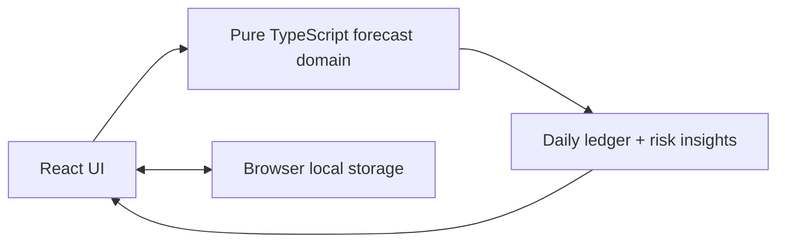

# Cashflow

Cashflow helps a student or early-career worker turn rough memories about income and spending into an editable, explainable 30-day cash forecast.

The application source is in [`cash-flow-forecaster/`](cash-flow-forecaster/).

## The user problem and workflow

People often need a cash forecast precisely because they do not already have a complete budget. They may remember rent and salary, but overlook meals out, subscriptions, groceries, or a bill due later in the month.

Cashflow starts with practical recognition prompts instead of a blank budget sheet. The user enters an opening balance, chooses a forecast start date, then can add rough estimates for income, groceries, transport, day-to-day routines, bills, subscriptions, and known upcoming costs. Every answer is optional and becomes a normal editable scheduled item marked **Estimated**. The dashboard then shows the lowest expected balance, first projected shortfall, balance trend, and a 30-day ledger explaining every movement.

## Scope

This is intentionally a local-first, single-user planning prototype. It does not connect to banks, categorise historical transactions, offer financial advice, provide accounts, or send data to a server. Forecast data remains in the current browser's local storage, so clearing site data or changing devices removes it.

That scope is deliberate: the challenge is about a complete, trustworthy forecasting workflow, not unrelated infrastructure. A backend becomes useful when users need sign-in, backup, or cross-device sync; the pure calculation engine can be retained unchanged behind that future boundary.

## Architecture



- **React + TypeScript** renders forms and the forecast.
- **Pure TypeScript domain functions** validate source items, expand recurrence, and calculate daily balances without UI or storage dependencies.
- **localStorage** persists only source settings and scheduled items; derived rows are recalculated on every load.
- **Recharts** visualises the same daily result shown in the ledger.

## Forecast rules

- Currency is Malaysian Ringgit. Amounts are stored as integer cents; decimal input is rounded with `Math.round(value * 100)`.
- The opening balance is the balance immediately before start-date scheduled items. It may be negative, in which case the start date is the first shortfall.
- The forecast includes exactly 30 local calendar dates, from start date through start date plus 29 days. Same-day items are aggregated; no intraday ordering is implied.
- A recurring item remains anchored to its first date. Backdated items are fast-forwarded so their valid in-window occurrences are included.
- Supported recurrence: one-off, daily, weekly, fortnightly, monthly, yearly, or a custom interval of every 2-365 days. Monthly items use days 1-28 and yearly items cannot use 29 February, avoiding silent calendar guesses.
- The lowest balance and first negative date refer to the end-of-day balance. Tied lowest balances retain the earliest date.

## Run locally

Tested with Node `22.17.1` and npm `10.9.2`.

```bash
cd cash-flow-forecaster
npm install
npm run dev
```

For a production check:

```bash
npm test
npm run build
npm run preview
```

Use **Load demo data** on the welcome screen to load the documented hand-worked scenario: salary, rent, groceries, phone plan, and insurance from 1-30 August 2026.

## Verification

| Check | Evidence | Outcome |
| --- | --- | --- |
| Money parsing | Unit tests cover `RM 12.34`, invalid text, and cent rounding | Passing |
| Local calendar dates | Unit tests cover valid dates, boundaries, and inclusive ranges | Passing |
| Recurrence | Unit tests cover daily, weekly, fortnightly, monthly, yearly, custom, and backdated schedules | Passing |
| Forecast results | Known-answer 30-day scenario plus negative opening balance and tied low-point tests | Passing |
| Persistence | Storage validation tests protect against corrupt or incompatible local data | Passing |
| Production build | `npm run build` compiles TypeScript and creates the static bundle | Passing |

Before recording the final demo, manually confirm a blank start, guided setup, skip/back navigation, add/edit/delete, refresh persistence, the demo scenario, invalid inputs, narrow-screen layout, and the day-one negative-opening warning.

## Limitations and next steps

The app forecasts scheduled estimates; it does not know a user's real payment history. Its output is only as reliable as the input the user chooses to add. For a production product, the next user-justified additions would be account-based backup and cross-device sync. That would require authenticated storage, server-side validation, row-level ownership controls, privacy policy, and a clear data-retention approach before any bank-data connection is considered.

## AI use

See [AI_USAGE.md](cash-flow-forecaster/AI_USAGE.md) for a factual record of AI-assisted work and the review performed for each use.
